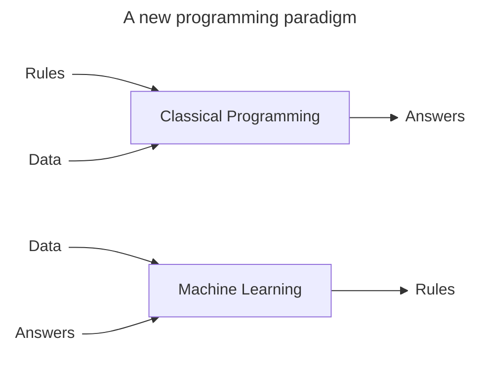

# Deep Learning with Python. Third Edition




Machine Learning algorithms merely search through a predefined set of operations, called a _hypothesis space_.
For instance, the space of all possible coordinate changes would be our hypothesis space in the 2D coordinates
classification example.

So that's what machine learning is, concisely: searching for useful representations and rules over some input data,
within a predefined space of possibilities, using guidance from a feedback signal. This simple idea allows us to solve
a remarkably broad range of intellectual tasks, from autonomous driving to natural language question-answering.

The "deep" in "deep learning" isn't a referency to any kind of deeper understanding achieved by the approach; rather,
it stands for this idea of successive layers of representations. Other appropriate names for the field could have been
_layered representations learning_ or _hierarchical representations learning_.

Although some of the central concepts in deep learning were developed in part by drawing inspiration from our
understanding of the brain (in particular, the visual cortex), deep learning models are not models of the brain.

You can think of a deep network as a multistage _information-distillation_ process, where information goes through
successive filters and comes out increasingly _purified_ (that is, useful with regard to some task).

Very simple mechanisms, sufficiently scaled, can end up looking like magic.

The specification of what a layer does to its input data is stored in the layer's weights. The transformation
implemented by a layer is _parameterized_ by its weights. In this context, _learning_ means finding a set of values for
the weights of all layers in a network, such that the network will correctly map example inputs to their associated
targets

You need to be able to measure how far this output is from what you expected. This is the job of the _loss_ function of
the network, also sometimes called the _objective  function_ or _cost function_.

The fundamental trick in deep learning is to use this score as a feedback signal to adjust the value of the weights a
little, in a direction that will lower the loss score for the current example. This adjustment is the job of the
_optimizer_, which implements what's called the _Backpropagation_ algorithm.

Despite its name, today's "artificial intelligence" is more accurately described as "cognitive automation" -
the encoding and operationalization of human skills and knowledge. Cognitive automation is incredibly useful.
But intelligence - cognitive autonomy - is a difference creature altogether.

Even with significant advancements, AI will remain a sophisticated tool, not a sentient being. It's like expecting a
better clock to lead to time travel - they're just different things altogether.

## The Mathematical Building Blocks of Neural Networks

The easiest way to setup a deep learning environment to run these notebooks is _Google Colaboratory_
(or Colab for short).

National Institute of Standards and Technology - the NIST in MNIST.

"Solving" MNIST is the "Hellow World" of deep learning.

In machine learning, a _category_ in a classification problem is called a _class_. Data points are called _samples_.
The class associated with a specific sample is called a _label_.

```py
import keras
from keras import layers

model = keras.Sequential([
    layers.Dense(512, activation="relu"),
    layers.Dense(10, activation="softmas")
])
```

The second (and last) layer is a 10-way _softmax classification_ layer, which means it will return an array of 10
probability scores (summing to 1).

To make the model ready for training, we need to pick three more things:


```py
model.compile(optimizer="adam", loss="sparse_categorical_crossentropy", metrics=["accuracy"])
```

To train the model in Keras, call the model's `fit()` method:

```py
model.fit(train_images, train_labels, epochs=5, batch_size=128)
```

### Data representations for neural networks
A tensor that contains only one number is called a _scalar_ (or scalar tensor, rank-0 tensor, or 0D tensor)

In deep learning, you'll generally manipulate tensors with ranks 0 to 4, although you may go up to 5 if you process
video data.

In general, the first axis (axis 0) in all data tensors you'll come across in deep learning will be the _sample axis_.

```py
n = 3
batch = train_images[128 * n : 128 * (n + 1)]
```

When considering such a batch tensor, the first axis (axis 0) is called the _batch axis_ (or _batch dimension_). You'll
frequently encounter this term when using Keras and other deep learning libraries.

The data you'll manipulate will almost always fall into one of the following categories:

- _Vector data_ - Rank-2 tensors of shape `(samples, features)`
- _Timeseries data or sequence data_ - Rank-3 tensors of shape `(samples, timesteps, features)`
- _Images_ - Rank-4 tensors of shape `(samples, height, width, channels)`
- _Video_ - Rank-5 tensors of shape `(samples, frames, height, width, channels)`

There are two conventions for the shapes of image tensors: the _channels-last_ convention (which is standard in JAX and
TensorFlow, as well as most other deep learning tools out there) and _channels-first_ convention (which is standard in
PyTorch).

In practice, when dealing with NumPy arrays, these operations are available as well-optimized built-in NumPy functions,
which themselves delegate the heavy lifting to a Basic Linear Algebra Subprograms (BLAS) implementation. BLAS are
low-level, highly parallel, efficient tensor-manipulation routines that are typically implemented in Fortran or C.

You can take the product between higher-dimensional tensors, following the same rules for shape compatibility as for
the 2D case:

```
(a, b, c, d) * (d,) -> (a, b, c)
(a, b, c, d) * (d, e) -> (a, b, c, e)
```

```
                     c
               |------------|
               |            |
               |            |
              b|            |
               |            |
       b       |------------|
 |-----------| ..............
 |           | .            .
a|           | .            .a
 |           | .            .
 |-----------| ..............
                     c
```
