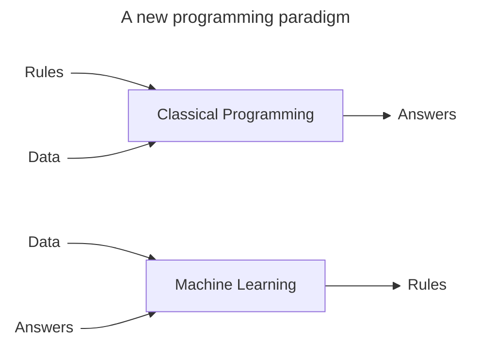

# Deep Learning with Python. Third Edition

```mermaid
---
title: A new programming paradigm
---
flowchart LR
    Rules@{       shape: text }
    Data@{        shape: text }
    Programming@{ shape: rect, label: "Classical Programming" }
    Answers@{     shape: text }

    Rules       --> Programming
    Data        --> Programming
    Programming --> Answers

    DataML@{    shape: text, label: "Data" }
    AnswersML@{ shape: text, label: "Answers" }
    ML@{        shape: rect, label: "Machine Learning" }
    RulesML@{   shape: text, label: "Rules" }

    DataML    --> ML
    AnswersML --> ML
    ML        --> RulesML
```
